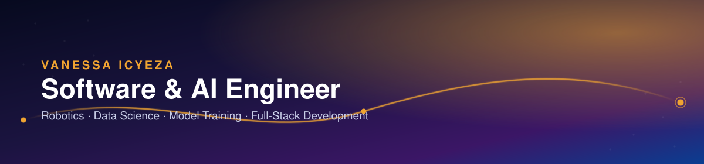

 

 

> I build things end-to-end — from a raw, messy CSV to a trained model, from a UI mockup to a working app. My focus right now is **AI/ML and data science**, backed by a full-stack developer's instinct for shipping working software, and a robotics engineer's curiosity for systems that sense and act in the real world.

<table>
<tr>
<td width="50%" valign="top">

### 🎯 What I do

- **Data science** — cleaning real-world data, exploratory analysis, honest model evaluation
- **ML / model training** — from classic ML (trees, forests, regression) toward deep learning
- **Robotics & AI systems** — embedded devices, computer vision, intelligent agents
- **Software development** — comfortable across many languages and stacks, not tied to one

</td>
<td width="50%" valign="top">

### 📌 Right now

- 🏍️ Shipping **[KigaliRide](https://github.com/Loice-vanessa/AIC-AI-PROJECT)** — predicting late moto-taxi rides from 60k+ real ride records
- 🌱 Deepening ML fundamentals: feature engineering, model comparison, overfitting, deployment
- 📝 Keeping an [honest build log](log/2026.md) of real sessions, no filler
- 💬 Open to collaborating on data / ML / robotics projects

</td>
</tr>
</table>

 

### 🧰 Core stack

  

<b>See the full toolbox</b> — languages, web, databases, cloud &amp; design

 

**Languages**

**Frontend & Web**

**Backend & Frameworks**

**AI, Robotics & Data Science**

**Databases**

**DevOps & Cloud**

**Tools & Design**

 

### 📌 Featured project

**KigaliRide — The Data Science Mission.** Cleaned 60,000+ ride records, explored what actually drives late rides (rush hour, rain, pickup zone), then trained and honestly evaluated a classifier that predicts lateness *before* the ride happens — plus feature engineering, model comparison, an overfitting study, and deployment on unseen bookings.

 

### 📊 GitHub activity

  
  

  

 

Thanks for stopping by — let's build something. → <a href="https://www.linkedin.com/in/vanessa-icyeza/">LinkedIn</a> · <a href="mailto:sagahutugerard11@gmail.com">Email</a>

